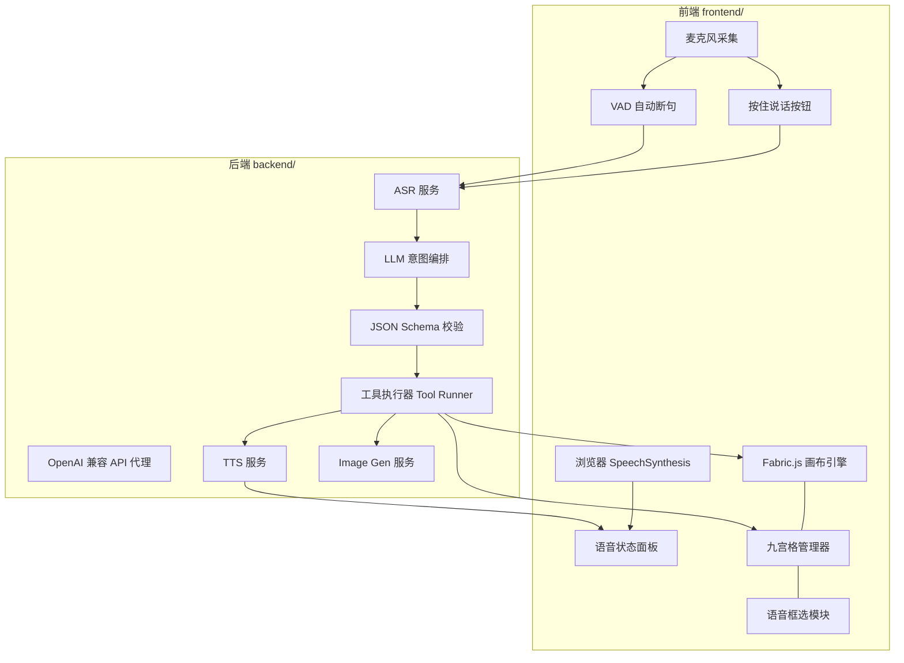
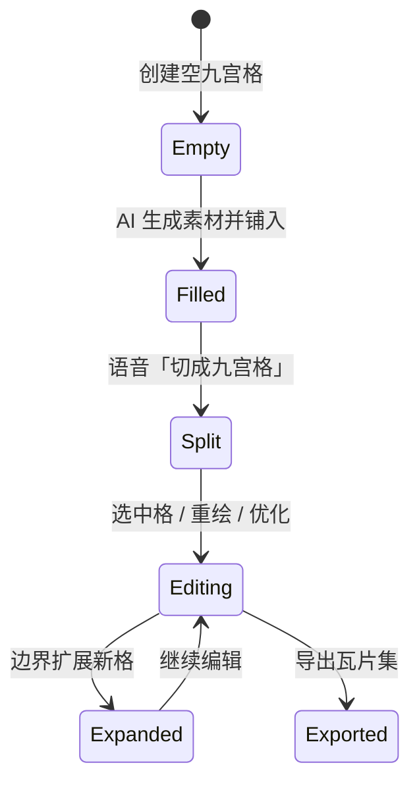

# VoiceCanvas 项目架构文档

> **产品定位：** 纯语音控制的智能绘图工作台，支持「矢量手绘」与「AI 生图」双模式，并以**可扩展九宫格画布**为核心场景，服务游戏地图素材、创意分镜等高效产出。  
> **技术栈：** React + TypeScript + Fabric.js / Python FastAPI / OpenAI 兼容 ASR·LLM·TTS·Image API  
> **运行方式：** 本地开发，无需部署（`frontend` + `backend` 分别启动）

---

## 目录

- [1. 产品目标与能力矩阵](#1-产品目标与能力矩阵)
- [2. 总体架构](#2-总体架构)
- [3. 双轨语音系统](#3-双轨语音系统)
- [4. 绘图模式](#4-绘图模式)
- [5. 九宫格画布系统](#5-九宫格画布系统)
- [6. 智能语音工具箱](#6-智能语音工具箱)
- [7. 指令理解与执行流水线](#7-指令理解与执行流水线)
- [8. 前端架构](#8-前端架构)
- [9. 后端架构](#9-后端架构)
- [10. 数据模型](#10-数据模型)
- [11. API 设计](#11-api-设计)
- [12. 目录结构](#12-目录结构)
- [13. 开发分期与 PR 规划](#13-开发分期与-pr-规划)
- [14. 配置与环境变量](#14-配置与环境变量)
- [15. 风险与对策](#15-风险与对策)

---

## 1. 产品目标与能力矩阵

### 1.1 三大绘画能力

| 模式 | 说明 | 是否调用绘画 AI | 典型场景 |
|------|------|:---------------:|----------|
| **简单绘画** | 通过语音对话，由系统解析为 Fabric 矢量绘图指令 | 否 | 画线、形状、文字标注、简单示意图 |
| **AI 绘画** | 通过语音描述，调用文生图 / 图生图 API 生成位图素材 | 是 | 场景概念图、角色、纹理、格子重绘 |
| **九宫格画布** | AI 素材切格 + 分格编辑 + 动态扩格，面向地图/创意生产 | 是（格级） | 游戏地块、瓦片集、分镜宫格 |

### 1.2 智能化目标

语音不仅是「下命令」，而是**高效产出流水线**：

- 理解复杂意图 → 拆解为多步工具调用 → 自动执行 → 语音反馈进度
- 带「自动化办公」意味：批量处理、模板导出、命名归档、一致性校验
- 画布级便捷能力：缩放、平移、语音框选、区域重绘

### 1.3 核心约束（比赛）

- 用户**不能使用鼠标或键盘**完成常规绘图操作（开发调试除外）
- 演示与评委体验须全程语音驱动

---

## 2. 总体架构



### 2.1 分层职责

| 层级 | 职责 | 关键技术 |
|------|------|----------|
| **感知层** | 采集音频、VAD、双模式触发 | Web Audio API、MediaRecorder |
| **理解层** | ASR 转写、LLM 意图解析、输入优化 | OpenAI 兼容 Chat / ASR |
| **编排层** | 工具选择、参数填充、多步队列 | FastAPI + Pydantic |
| **执行层** | Fabric 绘图、九宫格 CRUD、AI 生图 | Fabric.js、Image API |
| **反馈层** | 系统 TTS（轻量）/ AI TTS（完整） | speechSynthesis + TTS API |

### 2.2 设计原则

1. **绘图低延迟走本地**：简单绘画、画布变换、格位操作尽量不经过 AI
2. **复杂语义走 LLM**：多步编排、歧义消解、工具参数生成
3. **九宫格是一等公民**：独立数据模型，与主画布可切换但共享素材池
4. **工具可组合**：LLM 输出 `tools[]` 队列，而非单一 `draw` 指令
5. **API 可替换**：所有 AI 能力通过 OpenAI 兼容接口抽象，`.env` 切换供应商

---

## 3. 双轨语音系统

### 3.1 为什么需要双轨

| 轨道 | 引擎 | 适用场景 | 特点 |
|------|------|----------|------|
| **系统语音轨** | 浏览器 `SpeechSynthesis` + 本地规则解析 | 撤销、清空、放大、切换画布、确认取消 | 零 API 成本、响应 <100ms |
| **AI 语音轨** | ASR + LLM + TTS（OpenAI 兼容） | 复杂绘画、AI 生图、九宫格编排、框选重绘 | 高准确率、可优化输入、自然对话 |

### 3.2 采集模式：自动断句 + 按住说话（并存）

```
┌─────────────────────────────────────────┐
│  模式切换（语音）：「切换到连续模式」      │
│              「切换到按住说话」           │
├─────────────────────────────────────────┤
│  [连续模式]  VAD 检测静音 → 自动送 ASR   │
│  [按住模式]  按住按钮录音 → 松手送 ASR   │
└─────────────────────────────────────────┘
```

| 模式 | 行为 | 适用 |
|------|------|------|
| **自动断句** | 静音 ≥ 0.8s 自动提交；适合连续创作 | 九宫格批量指令、长句描述 |
| **按住说话** | 按下录音、松开识别；避免环境音误触 | 嘈杂环境、精确短指令 |

两种模式**共用同一套 ASR → LLM 流水线**，仅触发逻辑不同。

### 3.3 AI 语音识别与输入优化

ASR 原始文本经 **LLM 预处理节点**（轻量 prompt）做：

- **口语规范化**：「那个红色的圆大一点」→ 结构化意图
- **同义词归一**：「格子 / 宫格 / 地块」→ `grid_cell`
- **数字与方位解析**：「第三行第二个」「往上扩一格」
- **上下文补全**：结合当前选中格、画布缩放级别消歧
- **纠错建议**：置信度低时 TTS「你是要说撤销吗？」

```mermaid
sequenceDiagram
    participant U as 用户
    participant ASR as ASR API
    participant OPT as 输入优化 LLM
    participant ORC as 意图编排 LLM
    participant RUN as Tool Runner

    U->>ASR: 音频
    ASR->>OPT: 原始文本
    OPT->>ORC: 优化后文本 + 上下文
    ORC->>RUN: tools[] JSON
    RUN->>U: 执行 + TTS 反馈
```

---

## 4. 绘图模式

### 4.1 简单绘画（无绘画 AI）

**路径：** 语音 →（系统轨或 AI 轨）→ 本地规则 / 轻量 LLM → Fabric 指令

| 能力 | 语音示例 | 实现 |
|------|----------|------|
| 基础图形 | 「画一个红色圆形」「画一条从左上到右下的线」 | Fabric `Circle` / `Line` / `Rect` |
| 样式 | 「线宽 5」「改成蓝色」「半透明」 | 修改 `stroke` / `fill` / `opacity` |
| 文字 | 「写上标题：森林入口」 | Fabric `IText` |
| 变换 | 「选中最后一个图形放大一倍」 | Fabric `scale` / `rotate` |
| 历史 | 「撤销」「重做」 | 自定义 History Stack |
| 画布视图 | 「放大到 150%」「居中」「适应窗口」 | Fabric `viewportTransform` |

> 简单绘画优先走**系统轨 + 规则快路径**；仅当句子复杂时才升级到 AI 轨。

### 4.2 AI 绘画（调用绘画 AI）

**路径：** 语音描述 → LLM 生成 `image_prompt` + 参数 → Image API → 位图贴入画布

| 能力 | 语音示例 |
|------|----------|
| 文生图 | 「生成一张赛博朋克风格的城市夜景」 |
| 图生图 | 「以当前画布为基础，改成冬天」 |
| 局部重绘 | 「重绘选中区域为草地」 |
| 风格统一 | 「让所有格子统一成像素风格」 |

生成结果进入**素材池**，可：

- 铺满主画布
- 一键「切成九宫格」进入格阵模式
- 作为某一格的参考图进行 inpaint

### 4.3 主画布便捷功能

| 功能 | 语音示例 | 实现要点 |
|------|----------|----------|
| **缩放** | 「放大」「缩小到 50%」「显示实际大小」 | `canvas.setZoom()` |
| **平移** | 「向左移动」「回到中心」 | `viewportTransform` |
| **语音框选** | 「框选左上角区域」「选中中间那个圆」 | LLM 解析为坐标 / 对象 ID → Fabric `ActiveSelection` |
| **区域重绘** | 「把选中的区域重绘成雪地」 | 裁剪选区 → Image API inpaint → 贴回 |
| **图层** | 「把背景移到最上层」 | Fabric `bringToFront` 等 |

---

## 5. 九宫格画布系统

### 5.1 场景定位

九宫格不仅是 UI 布局，而是**可扩展的瓦片地图 / 创意分镜工作台**：

- 游戏地图素材：草地、水域、道路分格绘制与拼接
- 创意分镜：每格独立画面，整体审视构图
- 瓦片集导出：多格素材打包为 spritesheet

### 5.2 核心概念

```
GridCanvas
├── cells: Map<CellId, Cell>     # 稀疏存储，支持非矩形边界
├── layout: { origin, cellSize } # 格网几何
├── edges: 动态边界（可向外扩展）
└── globalAsset: 源图（AI 生成后切格的母图）
```

**Cell（格子）**

```ts
interface GridCell {
  id: string;           // 如 "0,0" 或 "r1c2"
  row: number;
  col: number;
  bounds: { x, y, width, height };
  imageData?: string;   // 当前格位图（data URL 或 blob ref）
  prompt?: string;      // 该格生成/重绘用的 prompt 历史
  status: 'empty' | 'filled' | 'generating' | 'error';
  metadata?: { tags, style };
}
```

### 5.3 九宫格生命周期



| 阶段 | 语音指令示例 | 系统行为 |
|------|--------------|----------|
| 创建 | 「新建九宫格画布」 | 3×3 空网格，默认格尺寸 |
| 导入 | 「把刚才生成的图切成九宫格」 | 按 3×3 切图，每格独立 `imageData` |
| 选中 | 「选中第一格」「选中右上角那格」 | 高亮格边框，更新上下文 |
| 重绘 | 「把这一格重绘成沙漠」 | 对该格调 Image API，仅更新该 cell |
| 优化 | 「让这一格更明亮」「去掉人物」 | img2img / inpaint + 格级 prompt 追加 |
| 扩展 | 「从第一格向上扩展一格」 | 在 `row-1, col` 插入新空 cell，AI 生成延续性内容 |
| 扩展 | 「右边再加两格」 | 动态增加列，保持邻接一致性 |
| 移动 | 「把第二格移到第四格位置」 | 交换/移动 cell 数据，更新坐标索引 |
| 合并 | 「把上面两格合并成一格」 | 合并图像与 bounds（P1） |
| 导航 | 「去第三行第二列」 | 平移视口聚焦该格 |

### 5.4 边界扩展（非固定九宫格）

网格采用**稀疏坐标系**，不限制 3×3：

```
        [0,-1]  扩展向上
[-1,0]  [0,0]  [1,0]  [2,0]  ...
                [0,1]
                [0,2]
```

- 「向上扩展一格」：在当前选中格 `(r,c)` 创建 `(r-1,c)`，以邻格边缘像素为 context 做 outpainting
- 「四周各扩展一圈」：批量创建外围 cells，队列顺序生成（带进度播报）

### 5.5 与主画布的关系

| 模式 | 说明 |
|------|------|
| `canvas_mode: free` | Fabric 自由矢量 + 位图主画布 |
| `canvas_mode: grid` | 九宫格 / N×M 格阵专用视图 |
| 切换 | 「切换到格阵模式」「回到自由画布」 |

两种模式共享：**素材池、历史栈、语音上下文**。

---

## 6. 智能语音工具箱

LLM 不直接「画图」，而是**调度工具（Tools）**。以下为建议工具清单，按优先级分层。

### 6.1 P0 — 核心工具（首期实现）

| 工具 ID | 名称 | 功能 | 语音触发示例 |
|---------|------|------|--------------|
| `draw_shape` | 矢量绘制 | 画线/圆/矩形/多边形/文字 | 「画一个红色矩形」 |
| `canvas_control` | 画布控制 | 缩放/平移/适应窗口/清空 | 「放大两倍」 |
| `history` | 历史操作 | 撤销/重做 | 「撤销」 |
| `select_region` | 区域选择 | 框选、按描述选中对象 | 「框选上半部分」 |
| `ai_generate` | AI 文生图 | 生成位图到画布或素材池 | 「生成一张森林」 |
| `ai_inpaint` | AI 局部重绘 | 对选区或指定格重绘 | 「把选中区域改成石头路」 |
| `grid_create` | 创建格阵 | 新建 N×M 网格 | 「新建九宫格」 |
| `grid_split` | 切格 | 将当前图切成九宫格 | 「切成九宫格」 |
| `grid_select` | 选格 | 选中指定格 | 「选中中间那格」 |
| `grid_redraw` | 格级重绘 | 重绘指定格 | 「第二格画成雪地」 |
| `grid_expand` | 扩展格位 | 向指定方向新增格 | 「向上扩展一格」 |
| `grid_move` | 移动格 | 交换或移动格内容 | 「把第一格移到第三格」 |

### 6.2 P1 — 效率工具（智能化 / 自动化办公感）

| 工具 ID | 名称 | 功能 | 语音触发示例 |
|---------|------|------|--------------|
| `batch_grid` | 批量格操作 | 对多格执行相同操作 | 「把所有空格生成草地」 |
| `style_sync` | 风格统一 | 提取参考格风格，应用到其他格 | 「让所有格统一成第二格的风格」 |
| `export_tiles` | 导出瓦片集 | 导出 spritesheet + JSON 元数据 | 「导出瓦片集」 |
| `export_sheet` | 导出分镜板 | 多格拼成一张预览图 | 「导出分镜图」 |
| `asset_tag` | 素材归档 | 为格/图层打标签命名 | 「把这一格标记为水域」 |
| `palette_extract` | 取色板 | 从选中区域提取主色 | 「提取配色方案」 |
| `align_distribute` | 对齐分布 | 多对象对齐 | 「水平居中排列」 |
| `template_apply` | 模板应用 | 应用预设地图模板（水域环绕等） | 「应用湖泊模板」 |
| `workflow_macro` | 宏工作流 | 执行预定义多步流程 | 「执行地图初始化流程」 |

### 6.3 P2 — 进阶工具（时间允许）

| 工具 ID | 名称 | 功能 |
|---------|------|------|
| `grid_merge` | 合并格 | 多格合并为一格 |
| `grid_subdivide` | 细分格 | 一格拆为四子格 |
| `version_snapshot` | 版本快照 | 「保存当前版本叫初稿」 |
| `diff_compare` | 对比预览 | 「对比上一版和这一版」 |
| `voice_guide` | 引导教程 | 新手语音引导流程 |

### 6.4 自动化办公意味的体现

| 场景 | 工具组合 | 效果 |
|------|----------|------|
| 地图快速铺底 | `workflow_macro` → `batch_grid` → `style_sync` | 一句话完成空地 → 草地 → 风格统一 |
| 素材交付 | `export_tiles` + `asset_tag` | 带命名与元数据的瓦片集，可直接进游戏引擎 |
| 迭代修改 | `version_snapshot` + `grid_redraw` + `diff_compare` | 版本化创作，类似「改稿流程」 |
| 一致性检查 | `style_sync` + LLM 视觉描述校验 | 「检查有没有风格不统一的格子」 |

---

## 7. 指令理解与执行流水线

### 7.1 LLM 输出格式（OpenAI Function Calling 风格）

```json
{
  "optimized_text": "将第2格重绘为雪地风格",
  "intent": "grid_edit",
  "tools": [
    {
      "name": "grid_select",
      "arguments": { "position": { "row": 1, "col": 2 } }
    },
    {
      "name": "grid_redraw",
      "arguments": {
        "prompt": "snow terrain, top-down game tile, seamless",
        "style": "pixel art"
      }
    }
  ],
  "reply": "已选中第2格，正在重绘为雪地风格",
  "track": "ai"
}
```

### 7.2 轨道分流规则

```
输入文本
  ├─ 命中本地命令词典（撤销/放大/清空…）→ track: system → 系统 TTS → 本地执行
  ├─ 命中简单 draw 正则 → track: system → Fabric 直接绘制
  └─ 其他 → track: ai → ASR 优化 → LLM tools[] → 后端执行 → AI TTS
```

### 7.3 多步队列与进度播报

- `tools[]` 顺序执行，每步更新 UI 状态
- 长任务（AI 生图）：「正在生成第 2 格，共 5 格」
- 失败隔离：单步失败不回滚已完成步骤，语音说明原因

### 7.4 上下文窗口（传给 LLM）

```json
{
  "canvas_mode": "grid",
  "zoom": 1.5,
  "selected_cell": "1,2",
  "grid_size": { "rows": 3, "cols": 3 },
  "recent_commands": ["..."],
  "objects_summary": "3 shapes: circle#1, rect#2, image#3"
}
```

---

## 8. 前端架构

### 8.1 技术栈

| 类别 | 选型 |
|------|------|
| 框架 | React 18 + TypeScript |
| 构建 | Vite |
| 画布 | Fabric.js 6.x |
| 状态 | Zustand（画布 / 格阵 / 语音 / 素材池分 store） |
| HTTP | axios → `backend` API |
| 音频 | MediaRecorder + Web Audio Analyser（波形 UI） |

### 8.2 模块划分

```
frontend/src/
├── app/                 # 路由、布局
├── components/
│   ├── canvas/          # Fabric 封装：FreeCanvas
│   ├── grid/            # GridCanvas、CellOverlay、ExpandHandles
│   ├── voice/           # MicButton、VADIndicator、TranscriptPanel
│   └── feedback/        # 状态条、进度、图形列表
├── engines/
│   ├── fabric/          # 绘图执行器、History
│   ├── grid/            # 切格、扩格、移格算法
│   └── selection/       # 语音框选 → 坐标/对象解析
├── services/
│   ├── api.ts           # 后端 API 客户端
│   ├── audio.ts         # 录音、VAD
│   └── systemVoice.ts   # 浏览器 TTS + 本地命令
├── stores/              # Zustand stores
├── hooks/               # useVoiceInput, useCanvas, useGrid
└── types/               # 与后端共享的类型定义（或 openapi 生成）
```

### 8.3 Fabric.js 使用策略

| 对象类型 | 用途 |
|----------|------|
| `fabric.Image` | AI 生成位图、格位图 |
| `fabric.Rect/Circle/Line` | 简单绘画 |
| `fabric.Group` | 格子内容分组 |
| `fabric.ActiveSelection` | 语音框选结果 |
| 自定义 `GridOverlay` | 格线、高亮、非 Fabric 原生 |

**History：** 封装 `canvas.undo()` / `redo()` 栈，格阵操作（扩格、移格）同样入栈。

### 8.4 语音 UI 状态机

```
idle → listening → transcribing → optimizing → planning → executing → speaking → idle
```

每个状态在面板显示，Demo 时评委可看清系统在哪个环节。

---

## 9. 后端架构

### 9.1 技术栈

| 类别 | 选型 |
|------|------|
| 框架 | FastAPI |
| 校验 | Pydantic v2 |
| HTTP 客户端 | httpx（异步调用 AI API） |
| 配置 | pydantic-settings + `.env` |

### 9.2 模块划分

```
backend/
├── app/
│   ├── main.py              # FastAPI 入口、CORS
│   ├── config.py            # 环境变量、API 端点
│   ├── routers/
│   │   ├── voice.py         # /voice/transcribe, /voice/synthesize
│   │   ├── intent.py        # /intent/parse（ASR 文本 → tools[]）
│   │   ├── image.py         # /image/generate, /image/inpaint
│   │   └── tools.py         # /tools/execute（可选：服务端执行校验）
│   ├── services/
│   │   ├── asr.py           # OpenAI 兼容 ASR
│   │   ├── llm.py           # 意图编排 + 输入优化
│   │   ├── tts.py           # OpenAI 兼容 TTS
│   │   ├── image_gen.py     # 文生图 / 图生图
│   │   └── tool_runner.py   # 工具定义注册与校验
│   ├── schemas/
│   │   ├── intent.py        # ToolCall, IntentResponse
│   │   ├── image.py
│   │   └── context.py       # 前端上下文模型
│   └── prompts/
│       ├── optimize.txt     # 输入优化 prompt
│       ├── orchestrate.txt  # 工具编排 prompt
│       └── tools.json       # 工具 JSON Schema 供 LLM
```

### 9.3 执行权划分

| 执行位置 | 内容 | 原因 |
|----------|------|------|
| **后端** | ASR、LLM、TTS、Image API 调用 | 隐藏 API Key |
| **前端** | Fabric 绘图、格阵 UI、贴图 | 低延迟、交互流畅 |
| **协作** | 后端返回 `tools[]`，前端 Tool Executor 执行 | 减少大图传输 |

> Image 生成在后端完成，返回图片 URL 或 base64；前端负责贴入 Fabric / 写入 Cell。

---

## 10. 数据模型

### 10.1 项目状态（前端 Store）

```ts
interface AppState {
  canvasMode: 'free' | 'grid';
  freeCanvas: {
    zoom: number;
    viewport: [number, number, number, number];
    objects: FabricObjectMeta[];
    history: HistoryEntry[];
  };
  gridCanvas: {
    cells: Record<string, GridCell>;
    selectedCellId: string | null;
    cellWidth: number;
    cellHeight: number;
  };
  assetPool: Asset[];          // AI 生成历史
  voice: {
    mode: 'continuous' | 'push_to_talk';
    track: 'system' | 'ai';
    status: VoiceStatus;
    lastTranscript: string;
  };
}
```

### 10.2 工具调用统一结构

```ts
interface ToolCall {
  name: string;
  arguments: Record<string, unknown>;
  id?: string;
}

interface ToolResult {
  toolCallId: string;
  success: boolean;
  data?: unknown;
  error?: string;
  message: string;   // 供 TTS 播报
}
```

---

## 11. API 设计

### 11.1 语音相关

| 方法 | 路径 | 说明 |
|------|------|------|
| POST | `/api/v1/voice/transcribe` | 上传音频 → ASR 文本 |
| POST | `/api/v1/voice/synthesize` | 文本 → 音频流（AI TTS） |
| POST | `/api/v1/intent/parse` | 文本 + 上下文 → tools[] + reply |

### 11.2 图像相关

| 方法 | 路径 | 说明 |
|------|------|------|
| POST | `/api/v1/image/generate` | 文生图 |
| POST | `/api/v1/image/inpaint` | 局部重绘（mask + prompt） |
| POST | `/api/v1/image/outpaint` | 扩图（用于格边界扩展） |

### 11.3 请求示例：`/api/v1/intent/parse`

```json
// Request
{
  "text": "把第一格向上扩一格，画成森林",
  "context": {
    "canvas_mode": "grid",
    "selected_cell": "0,0",
    "grid_cells": ["0,0", "0,1", "1,0", "1,1", "2,0", "2,1", "2,2"]
  }
}

// Response
{
  "optimized_text": "从单元格(0,0)向上扩展一格并生成森林风格图像",
  "track": "ai",
  "tools": [
    { "name": "grid_expand", "arguments": { "direction": "up", "from_cell": "0,0" } },
    { "name": "grid_redraw", "arguments": { "cell": "-1,0", "prompt": "forest, top-down tile" } }
  ],
  "reply": "正在向上扩展一格并绘制森林"
}
```

---

## 12. 目录结构

```
qiliuyun/
├── frontend/                 # React + Fabric.js
│   ├── src/
│   ├── package.json
│   └── vite.config.ts
├── backend/                  # FastAPI
│   ├── app/
│   ├── requirements.txt
│   └── .env                  # 本地 API 配置（不入库）
├── docs/
│   ├── ARCHITECTURE.md       # 本文档
│   └── DESIGN.md             # 指令能力计划/实现/未完成（比赛交付）
├── PROJECT_GUIDE.md            # 活动规则与提交规范
├── README.md                   # 启动说明、依赖、Demo 链接
├── .env.example                # API 配置模板
└── .gitignore
```

### 本地启动（无需 Docker 部署）

```bash
# 后端
cd backend && pip install -r requirements.txt && uvicorn app.main:app --reload --port 8000

# 前端
cd frontend && npm install && npm run dev
```

---

## 13. 开发分期与 PR 规划

### Phase 1 — 基础骨架（第 1 周）

| PR | 内容 |
|----|------|
| PR-01 | Monorepo 脚手架、README、`.env.example` |
| PR-02 | Fabric 自由画布 + 简单绘画（规则解析） |
| PR-03 | 撤销/重做、缩放平移、系统 TTS 反馈 |
| PR-04 | FastAPI 骨架 + OpenAI 兼容配置层 |
| PR-05 | 双模式语音采集（VAD + 按住说话） |

### Phase 2 — AI 全链路（第 2 周）

| PR | 内容 |
|----|------|
| PR-06 | ASR 接入 + 转写面板 |
| PR-07 | LLM 意图解析 + 输入优化 |
| PR-08 | AI TTS 反馈 |
| PR-09 | AI 文生图 + 贴入画布 |
| PR-10 | 语音框选 + 区域重绘（inpaint） |

### Phase 3 — 九宫格核心（第 2～3 周）

| PR | 内容 |
|----|------|
| PR-11 | 九宫格数据模型 + 视图 |
| PR-12 | 切格：AI 图 → 九宫格 |
| PR-13 | 格级选中、重绘、优化 |
| PR-14 | 边界扩展（up/down/left/right） |
| PR-15 | 格位移动与交换 |

### Phase 4 — 智能化与交付（第 3 周）

| PR | 内容 |
|----|------|
| PR-16 | 批量格操作 + 风格统一 |
| PR-17 | 导出瓦片集 / 分镜板 |
| PR-18 | 工作流宏 + 素材 tagging |
| PR-19 | DESIGN.md 定稿 + Demo 视频 |

---

## 14. 配置与环境变量

```bash
# .env.example

# === OpenAI 兼容通用 ===
OPENAI_API_KEY=sk-xxx
OPENAI_BASE_URL=https://api.example.com/v1

# === ASR ===
ASR_MODEL=whisper-1
# 或独立端点
ASR_BASE_URL=
ASR_API_KEY=

# === LLM（意图编排）===
LLM_MODEL=gpt-4o-mini

# === TTS ===
TTS_MODEL=tts-1
TTS_VOICE=alloy

# === Image Gen ===
IMAGE_MODEL=dall-e-3
# 图生图 / inpaint 模型（若供应商不同可单独配置）
IMAGE_EDIT_MODEL=

# === 服务 ===
BACKEND_PORT=8000
CORS_ORIGINS=http://localhost:5173
```

所有供应商统一走 **OpenAI 兼容客户端**，通过不同 `BASE_URL` + `MODEL` 切换。

---

## 15. 风险与对策

| 风险 | 对策 |
|------|------|
| AI 生图慢，语音体验卡顿 | 异步队列 + 进度 TTS；格级生成显示 loading 动画 |
| 扩格/outpaint 不连贯 | 邻格边缘像素作 context；prompt 带「seamless tile」 |
| LLM 工具参数错误 | Pydantic 校验 + 自动重试 1 次；失败语音解释 |
| 纯语音难以精确框选 | 支持「上半部分」「左边三分之一」等相对区域 + 当前选中格 |
| API 配额 / 费用 | 简单指令走系统轨；Demo 前缓存示例素材 |
| Fabric 与格阵状态不同步 | 格阵模式独立 store，切模式时快照 |

---

## 附录：指令能力速查（设计文档预览）

详见 `docs/DESIGN.md`（开发过程中同步更新）。

| 分类 | 计划支持 | 首期 P0 |
|------|----------|---------|
| 简单绘画 | 线/圆/矩形/文字/样式/变换 | ✅ |
| AI 绘画 | 文生图、局部重绘 | ✅ |
| 九宫格 | 切格/选格/重绘/扩格/移格 | ✅ |
| 画布 | 缩放/平移/框选 | ✅ |
| 效率工具 | 批量/导出/风格统一/宏 | P1 |

---

*文档版本：v1.0 | 随实现迭代更新*
